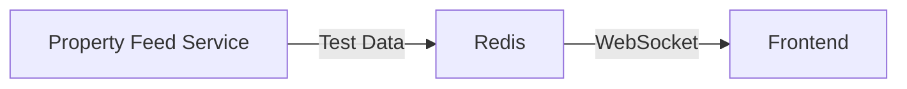
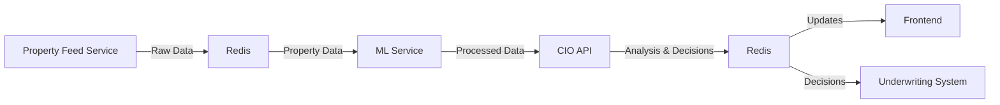
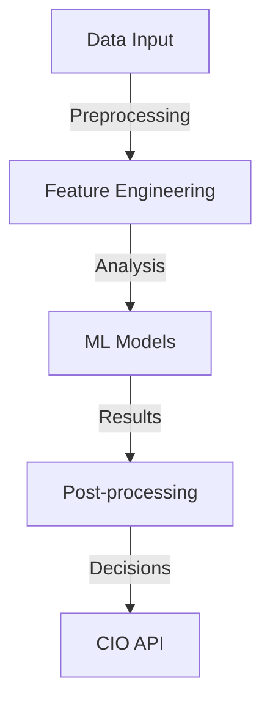

# Equihome Infrastructure

This repository contains the infrastructure code for the Equihome platform, including the frontend application, ML service, and property feed service.

## Project Structure

```
infrastructure/
├── equihome-platform2/         # Main frontend application
│   ├── ml_service/            # Machine Learning service
│   ├── property-feed-service/ # Property Feed service
│   └── data-infrastructure/   # Data infrastructure components
```

## Prerequisites

- Node.js (v18+)
- Python 3.8+
- Redis
- Git

## Setup Instructions

1. Clone the repository:
   ```bash
   git clone https://github.com/equihomepartners/infrastructure.git
   cd infrastructure
   ```

2. Install and start Redis:
   ```bash
   brew install redis
   brew services start redis
   ```

3. Set up the frontend application:
   ```bash
   cd equihome-platform2
   npm install
   ```

4. Set up the ML service:
   ```bash
   cd ml_service
   pip install -r requirements.txt
   ```

5. Set up the property feed service:
   ```bash
   cd property-feed-service
   npm install
   ```

## Running the Services

1. Start the frontend application (port 3001):
   ```bash
   cd equihome-platform2
   npm run dev
   ```

2. Start the ML service (port 3008):
   ```bash
   cd ml_service
   python3 main.py
   ```

3. Start the property feed service (port 3006):
   ```bash
   cd property-feed-service
   npm run dev
   ```

## Service URLs

- Frontend: http://localhost:3001
- ML Service: http://localhost:3008
- Property Feed Service: http://localhost:3006

## Troubleshooting

1. Port conflicts:
   - Check for processes using required ports: `lsof -i :3001,3002,3006,3008`
   - Kill conflicting processes if needed

2. Redis connection issues:
   - Ensure Redis is running: `brew services list | grep redis`
   - Restart Redis if needed: `brew services restart redis`

3. ML Service issues:
   - The service will train a new model when data becomes available
   - Check logs for training status and errors

## Development Notes

- The frontend uses Vite for development
- Hot Module Replacement (HMR) is enabled for frontend development
- ML service automatically handles model training
- Property feed service uses nodemon for auto-reloading

## Project Overview
Real-time property analytics and portfolio management platform with ML-driven insights.

## Architecture

### Current Implementation (Test Mode)


- ✅ Property Feed Service (5-min updates)
- ✅ Redis pub/sub messaging
- ✅ Frontend real-time display
- ✅ WebSocket communication

### Target Architecture


## Components Status

### 1. Data Infrastructure
#### Implemented ✅
- Property Feed Service
  - Test data generation
  - Redis pub/sub integration
  - WebSocket server
  - Real-time updates

#### To Be Implemented 🚧
- Data Lake
  - [ ] AWS S3 for raw data
  - [ ] PostgreSQL/MongoDB for structured data
  - [ ] Data versioning system
  - [ ] Historical data management

- ETL Pipeline
  - [ ] Data validation
  - [ ] Cleaning procedures
  - [ ] Feature extraction
  - [ ] Quality checks

### 2. ML/AI Layer 🚧 (HIGH PRIORITY)
#### Implementation Options Analysis

1. Custom LLM Development (Complex, Long-term)
   - Requirements:
     * Large dataset of real estate transactions
     * Significant compute resources
     * 3-6 months development time
     * ML engineering team
   - Components:
     * Training pipeline
     * Model architecture
     * Fine-tuning system
     * Inference API
   - Challenges:
     * Data collection & cleaning
     * Model training costs
     * Performance optimization
     * Ongoing maintenance

2. External API Integration (Recommended First Phase)
   - Options:
     * GPT-4 with fine-tuning
     * Grok API (when available)
     * Specialized Real Estate APIs
   - Benefits:
     * Faster implementation
     * Lower initial cost
     * Proven reliability
     * Regular updates
   - Integration Points:
     * Property analysis
     * Market trends
     * Risk assessment
     * Investment recommendations

3. Hybrid Approach (Long-term Goal)
   - Phase 1: External API
     * Quick deployment
     * Data collection starts
     * System validation
   - Phase 2: Custom Models
     * Specific use cases
     * Proprietary features
     * Unique insights
   - Phase 3: Full LLM
     * Based on collected data
     * Specialized training
     * Custom architecture

#### ML Service Architecture


### 3. CIO API Layer 🚧
- Traffic Light System
  - Zone classification
  - Risk assessment
  - Market analysis
- Decision Engine
  - Investment rules
  - Risk thresholds
  - Approval criteria

### 4. Underwriting Integration
- Decision consumption
- Automated processing
- Risk evaluation
- Approval workflow

## Development Roadmap

### Phase 1: ML Integration (Current Focus)
1. External API Setup
   - Select provider (GPT-4 recommended)
   - Integration architecture
   - API endpoint design
   - Testing framework

2. Initial ML Features
   - Property analysis
   - Market assessment
   - Basic risk scoring
   - Zone classification

### Phase 2: CIO API Development
1. Traffic Light System
   - Classification engine
   - Risk assessment
   - Real-time updates

2. Decision Engine
   - Rule processing
   - Risk evaluation
   - Approval logic

### Phase 3: Underwriting Integration
1. System Connection
   - API endpoints
   - Data flow
   - Decision processing

2. Automation
   - Workflow integration
   - Status tracking
   - Reporting system

## Setup Instructions
See [setupreadme.md](equihome-platform2/setupreadme.md) for detailed setup instructions.

## Development Guidelines

### Code Organization
```
equihome-infrastructure/
├── data-infrastructure/    # Data lake and ETL pipelines
├── ml-services/           # ML models and APIs
├── portfolio-analytics/    # Analytics and scoring
└── equihome-platform2/    # Frontend and property feed
```

### Best Practices
1. Data Management
   - Version all data changes
   - Maintain data lineage
   - Regular quality checks

2. ML Development
   - Track model versions
   - Document training data
   - Monitor performance

3. Code Quality
   - Write tests
   - Document APIs
   - Regular code reviews

## Environment Setup
See [environment setup](equihome-platform2/setupreadme.md#environment-variables) for required configurations.

## Contributing
1. Branch naming: feature/[feature-name]
2. Commit messages: Clear and descriptive
3. PR reviews required
4. Update documentation

## Next Steps
1. [x] Property Feed Service setup
2. [x] Redis implementation
3. [x] Frontend display
4. [ ] ML Service implementation (CURRENT PRIORITY)
   - External API integration
   - Basic analysis pipeline
   - Decision engine foundation
5. [ ] CIO API development
6. [ ] Underwriting system integration

# Equihome CIO Dashboard

## Infrastructure Overview

### 1. Data Sources
- Property Data APIs (Domain/REA)
- NSW Digital Twin API (Suburb Boundaries)
- ABS Statistical Area Data
- Economic Indicators API
- Infrastructure Development Data
- Census and Demographic Data

### 2. ML Infrastructure
- Model Training Pipeline
  - Data preprocessing
  - Feature engineering
  - Model training and validation
  - Model versioning and storage
- Inference Pipeline
  - Real-time data processing
  - Batch predictions
  - Confidence scoring
  - Zone classification

### 3. Map Visualization
- Base Layer: OpenStreetMap
- Boundary Layer: NSW Digital Twin API
- Dynamic Zoning Layer
  - Real-time zone updates
  - Confidence indicators
  - Interactive elements

### 4. Backend Services
- Data Integration Service
  - API Gateway
  - Data Transformation
  - Caching Layer
- ML Service
  - Model Management
  - Inference API
  - Monitoring
- Analytics Service
  - Historical Analysis
  - Trend Detection
  - Risk Assessment

### 5. Development Environment
```bash
# Install dependencies
npm install

# Start development server
npm run dev

# Run tests
npm test
```

### 6. Production Deployment
- AWS Infrastructure
  - EC2 for API servers
  - S3 for static assets
  - RDS for database
  - SageMaker for ML models
  - CloudFront for CDN
  - Route53 for DNS

### 7. ML Model Details
The traffic light zoning system uses multiple ML models:

#### Geographic Model
- Analyzes location-based features
- Processes infrastructure data
- Evaluates accessibility metrics

#### Market Analysis Model
- Price trend analysis
- Supply/demand metrics
- Market sentiment analysis

#### Risk Assessment Model
- Volatility analysis
- Economic stability
- Demographic trends

#### Transition Prediction Model
- Zone change probability
- Growth trajectory
- Development impact

### 8. Data Flow
1. Data Collection
   - Real-time property data
   - Market indicators
   - Economic data
   - Infrastructure updates

2. Processing Pipeline
   - Data validation
   - Feature extraction
   - ML model inference
   - Confidence calculation

3. Visualization
   - Zone classification
   - Interactive map
   - Analytics dashboard
   - Trend visualization

### 9. Configuration
Environment variables required:
```env
# API Keys
DOMAIN_API_KEY=your_key
REA_API_KEY=your_key
NSW_DIGITAL_TWIN_KEY=your_key

# ML Model
ML_MODEL_VERSION=latest
ML_CONFIDENCE_THRESHOLD=0.75

# Database
DB_CONNECTION_STRING=your_connection_string

# Services
API_URL=http://localhost:3000
ML_SERVICE_URL=http://localhost:3007
```

### 10. Contributing
Please read CONTRIBUTING.md for details on our code of conduct and the process for submitting pull requests.

### 11. License
This project is licensed under the MIT License - see the LICENSE.md file for details. 